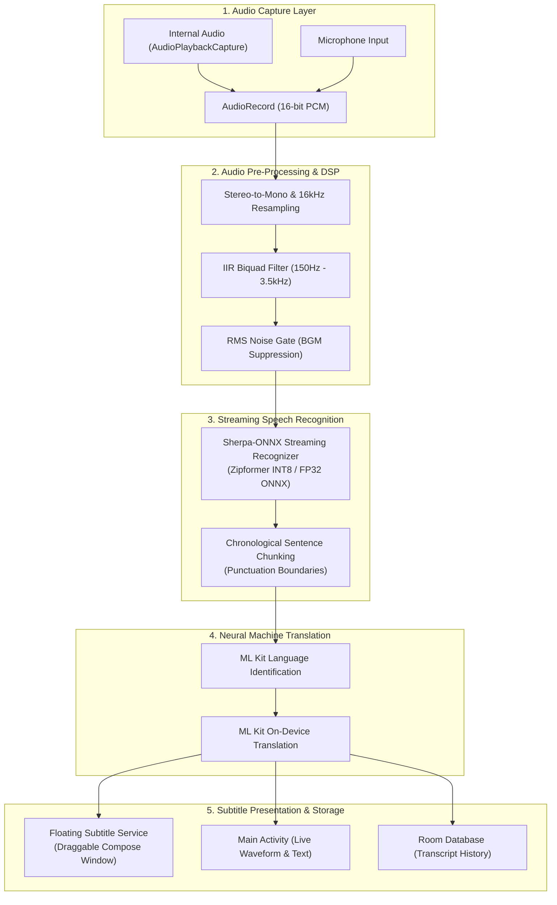

# Live Audio Translator 🎧🌐

[-brightgreen.svg)](https://developer.android.com)
[-blue.svg)](https://developer.android.com)
[](https://github.com/k2-fsa/sherpa-onnx)
[](https://developers.google.com/ml-kit)
[](https://developer.android.com/jetpack/compose)
[](#privacy--offline-first)

**Live Audio Translator** is a privacy-first, on-device Android application that captures internal system audio or microphone input in real time, generates streaming speech-to-text transcripts using **Sherpa-ONNX Zipformer**, and translates dialogue using **Google ML Kit Translate**—displaying synchronous floating subtitles directly on top of videos, live streams, games, and voice calls.

---

## 🌟 Key Features

- **Direct Internal Audio Capture**: Uses Android's `AudioPlaybackCaptureConfiguration` (MediaProjection API) to capture internal game, video, and app audio with zero ambient background noise (Android 10+).
- **Dual Capture Modes**: Instantly toggle between internal media audio and microphone capture.
- **Ultra-Low Latency Streaming ASR**:
  - Powered by offline Sherpa-ONNX Zipformer models.
  - **Fast Tier**: ~85–100ms response time, optimized for fast-paced action and gaming.
  - **Cinematic Tier**: High accuracy tuned for complex dialogue, accents, and film grammar.
  - Supported models: Japanese, English, Spanish, Chinese, Korean, and Bilingual Chinese/English.
- **Completely On-Device Translation**:
  - Offline neural translation powered by Google ML Kit.
  - Automatic language identification with confidence scoring.
  - Bidirectional language swapping and clause boundary punctuation segmentation.
- **Audio DSP & Voice Isolation**:
  - Cascaded 2nd-order Butterworth IIR Biquad bandpass filter (150 Hz high-pass to 3500 Hz low-pass) to strip background music (BGM), mechanical hum, and sound effects.
  - RMS energy noise gate to suppress false triggers during music or ambient pauses.
- **Interactive Floating Subtitle Overlay**:
  - System alert window (`SYSTEM_ALERT_WINDOW`) hosting Jetpack Compose inside a background service.
  - Draggable, resizable, collapsible, with support for landscape and portrait auto-clamping.
  - Customizable visual themes: *Anime Amber*, *Cinema Dark*, *Manga Clean*, and *High Contrast Yellow*.
  - Configurable font sizes, opacity, max lines (1–3 with auto-rolloff), and subtitle linger timers.
- **Quick Settings Tile**: Start and stop real-time translation directly from Android's Quick Settings shade without opening the main app.
- **DRM & Silence Detection**: Monitors continuous absolute silence to warn users when apps block internal audio capture via `FLAG_SECURE` or DRM protections.
- **Transcript History**: Room Database persistence with search, filtering, and export capabilities.

---

## 📐 Architecture Overview



---

## 🛠️ Tech Stack & Dependencies

| Layer | Technologies |
| :--- | :--- |
| **Language & Tooling** | Kotlin 2.0+, Kotlin Coroutines & Flow, KSP |
| **UI Framework** | Jetpack Compose (BOM), Material 3, Custom ViewTree Lifecycle |
| **Speech-to-Text (ASR)** | [Sherpa-ONNX](https://github.com/k2-fsa/sherpa-onnx) (Zipformer Streaming ONNX models) |
| **Machine Translation** | [Google ML Kit Translate](https://developers.google.com/ml-kit/language/translation) & Language ID |
| **Audio Processing** | Android AudioRecord, AudioPlaybackCapture, Custom Biquad DSP |
| **Local Storage** | Room Database, DataStore Preferences |
| **Network & Archives** | OkHttp 4, Apache Commons Compress (BZip2 / Tar / Zip) |
| **Testing** | JUnit 4, Robolectric, Kotlinx Coroutines Test, Compose UI Test |

---

## 📋 System Requirements & Permissions

- **Minimum SDK**: Android 10 (API 29) — Required for internal audio playback capture.
- **Target SDK**: Android 15 (API 35).
- **Compile SDK**: Android 16 (API 36.1).
- **NDK ABIs**: `arm64-v8a`, `armeabi-v7a`, `x86_64`.

### Required Android Permissions

- `android.permission.RECORD_AUDIO`: Capturing internal audio streams and microphone input.
- `android.permission.SYSTEM_ALERT_WINDOW`: Displaying the draggable floating subtitle window over other applications.
- `android.permission.FOREGROUND_SERVICE`: Running audio capture and subtitle services continuously in the background.
- `android.permission.FOREGROUND_SERVICE_MEDIA_PROJECTION`: Android 14+ requirement for screen/audio capture services.
- `android.permission.FOREGROUND_SERVICE_MICROPHONE`: Android 14+ requirement for microphone capture services.
- `android.permission.POST_NOTIFICATIONS`: Showing active foreground capture notifications and download progress.
- `android.permission.INTERNET`: One-time downloading of offline Sherpa-ONNX models and ML Kit language packs.

---

## 🚀 Getting Started & Building

### Prerequisites

1. **Android Studio**: Android Studio Koala / Ladybug or newer.
2. **JDK**: Java Development Kit 17 or 21.
3. **Android SDK**: API Level 35 SDK and Build-Tools installed.
4. **NDK**: NDK 26+ installed via Android SDK Manager.

### Clone and Open Project

```bash
git clone https://github.com/<your-username>/Live-Audio-Translator.git
cd Live-Audio-Translator
```

Open the project directory in Android Studio. Gradle will sync dependencies automatically.

### Build via Command Line

```bash
# Debug APK
./gradlew assembleDebug

# Release APK (minified with ProGuard/R8)
./gradlew assembleRelease

# Run unit tests
./gradlew test
```

---

## 📦 Model Management & Offline Operation

### 1. Sherpa-ONNX Speech Models
The app downloads lightweight streaming Zipformer models directly from the official k2-fsa releases into the app's internal sandbox storage (`/data/user/0/.../files/models/`):

- **Japanese**:
  - Fast: `sherpa-onnx-streaming-zipformer-ja-reazonspeech-2024-06-24` (~38 MB)
  - Cinematic: `sherpa-onnx-streaming-zipformer-ja-large-2024-06-24` (~88 MB)
- **English**:
  - Fast: `sherpa-onnx-streaming-zipformer-en-20M-2023-02-17` (~42 MB)
  - Cinematic: `sherpa-onnx-streaming-zipformer-en-large-2023-06-26` (~92 MB)
- **Spanish**: Kroko 2025 Fast & Large models (~36 MB – ~82 MB)
- **Chinese / Bilingual**: 14M Fast & Bilingual ZH-EN models (~32 MB – ~115 MB)
- **Korean**: Korean 2024 Fast model (~39 MB)

*All archives are validated, storage space is pre-checked (StatFs ≥ 150 MB), and extraction is secured against Zip Slip path traversal.*

### 2. Google ML Kit Language Packs
Translations are performed entirely offline using Google ML Kit's on-device models. Language packs (~30 MB each) can be downloaded on-demand from within the app settings.

---

## 🔒 Privacy & Offline-First Design

- **100% On-Device Processing**: Neither captured audio, transcribed text, nor translated subtitles are sent to remote servers.
- **No Cloud Inference Cost**: Translation and ASR run locally on device CPU/NPU using quantized INT8 ONNX models and TensorFlow Lite.
- **Local Persistence**: Transcript history remains stored in local Room SQLite storage until manually cleared by the user.

---

## 🤝 Contributing

Contributions, bug reports, and pull requests are welcome!
1. Fork the project.
2. Create your feature branch (`git checkout -b feature/MyFeature`).
3. Commit your changes (`git commit -m "Add MyFeature"`).
4. Push to the branch (`git push origin feature/MyFeature`).
5. Open a Pull Request.

---

## 📄 License

This project is open-source and available under the [Apache License 2.0](LICENSE).
ASR models are distributed under their respective licenses from [k2-fsa / Sherpa-ONNX](https://github.com/k2-fsa/sherpa-onnx).
